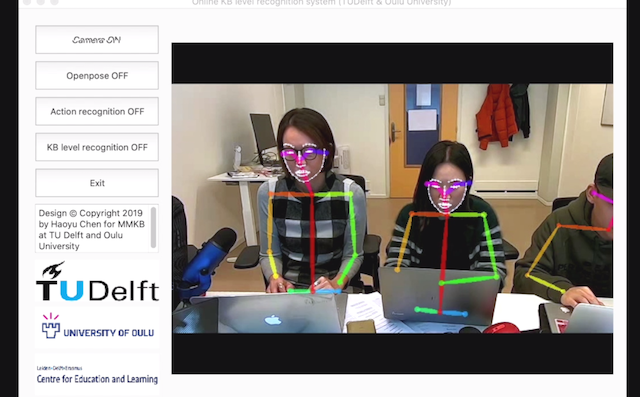
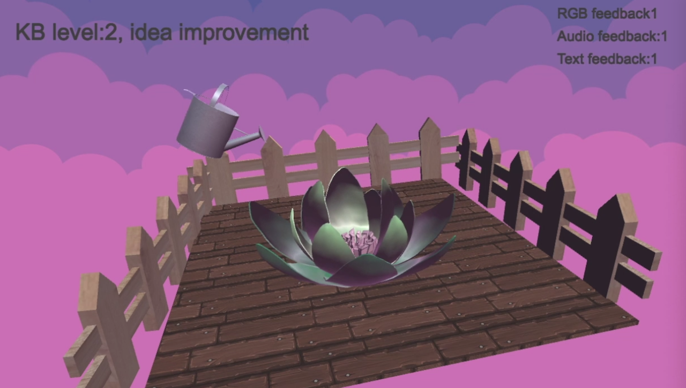
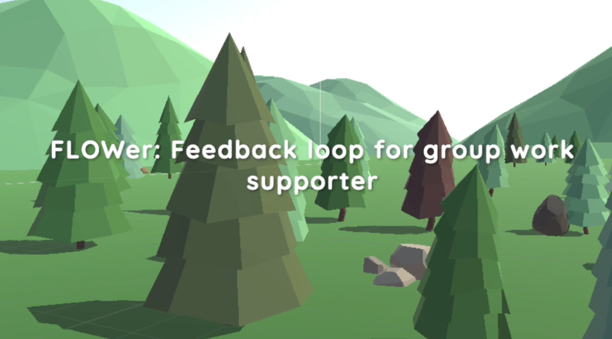
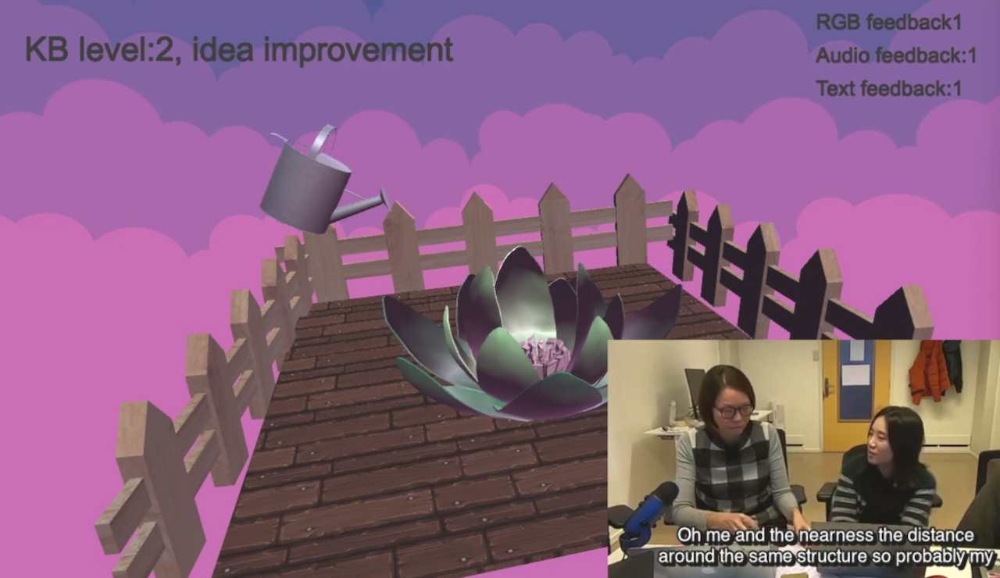

'Design © Copyright 2019 by Haoyu Chen for MMKB at TU Delft and Oulu University'

MMLA_realtime_visualization
==========================

Multi-modal learning analytics for realtime visualization for CEL TUDelft and NIE in NTU singapore

Realtime - mmla learning analytics for collaborative learning

<p align="center">
    
</p>


## Operating Systems
- **Mac OSX** Mavericks and above.

## Requirements and Dependencies
    - Python 3.5 and above
    - Unity 2018.4 and above
    - Using [Anaconda](https://www.anaconda.com/download/) is recommended.
    - Opencv
        ```
            pip install opencv-python
        ```
    - tensorflow1.3
        ```
            pip install tensorflow-gpu==1.3.0
        ```
    - filterpy
        ```
            pip install filterpy
        ```
       
## Usage：

### step one

Move to RealtimeOpenpose folder

Run:
```
python run_TUDelft_visualization.py
```

to achieve the realtime recognition

### step two

Use Unity to open the project from MMLA_Visualization_complete_version ~~(Visualization demo)~~ folder for version 2 ~~version 1~~.

build and run the project by press cmd+B

to achive the realtime feedback


## Function：

### RealtimeOpenpose:

1. Openpose realtime recognition

2. Action realtime recognition

3. Collaborative level realtime recognition

<p align="center">
    
</p>

### Visualization demo

1. Realtime time feedback

2. Visualization of the ~~flower growth~~

<p align="center">
    
</p>

3. Visualization of the plant growth

<p align="center">
    
</p>


## Note：

1. It's a cpu version, better result should be achieved by GPU

2. Frame rate with CPU version is 0.8-1.0

## To do：

1. More elements in the visualization

2. Realtime speech recognition

3. More indicators design


## see more from the youtube video:

[Realtime demo version1](https://www.youtube.com/watch?v=He0g9OeblY8) 
[Realtime demo version2, LAK demo](https://www.youtube.com/watch?v=pco-YoR3BFs) 


<p align="center">
    
      
    
</p>


## Citation
Please cite these papers in your publications if it helps your research. 

    @inproceedings{haoyu@icls,
      author = {Haoyu Chen and Esther Tan and Yoon Lee and Sambit Paharaj and Marcus Specht and Guoying Zhao},
      booktitle = {The International Conference of the learning sciences},
      title = {Developing AI into Explanatory Supporting Models: An Explanation-visualized Deep Learning Prototype for Computer Supported Collaborative Learning},
      year = {2020}
    }
    
    @inproceedings{yoon@lak,
      author = {Yoon Lee, Haoyu Chen, Esther Tan, Sambit Praharaj, Marcus Specht},
      booktitle = {International Learning Analytics and Knowledge (LAK) Conference, demo session},
      title = {FLOWer: Feedback Loop for Group Work Supporter},
      year = {2020}
    }

## Acknowledge
MMLA realtime visualization is freely available for free non-commercial use. Thanks to team members: Yoon Lee, Haoyu Chen, Esther Tan, Sambit Paharaj, Marcus Specht and Guoying Zhao.
Copyright@ Technology university of Delft & University of Oulu
