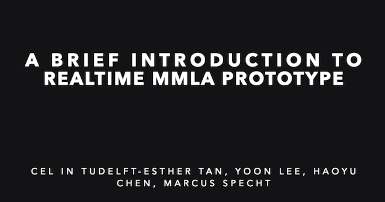

'Design © Copyright 2019 by Haoyu Chen for MMKB at TU Delft and Oulu University'

MMLA_realtime_visualization
==========================

Multi-modal learning analytics for realtime visualization for CEL TUDelft and NIE in NTU singapore

Realtime - mmla learning analytics for collaborative learning

## Usage：

1. step one

move to RealtimeOpenpose folder

run:

python run_TUDelft_visualization.py

to achieve the realtime recognition

2. step two

use unity to open the project from Visualization demo folder

build and run the project by press cmd+B

to achive the realtime feedback

## Function：

### RealtimeOpenpose:

1. openpose realtime recognition

2. action realtime recognition

3. KB level realtime recognition

    

### Visualization demo

1. realtime time feedback

2. visualization of the flower growth

    

## Note：

1.it's a cpu version, better result should be achieved by GPU

2.frame rate with CPU version is 0.8-1.0

3.only test on Mac

## To do：

1.more elements in the visualization

2.realtime speech recognition

3.more indicators design

## see more from the youtube video:

[Realtime demo](https://www.youtube.com/watch?v=He0g9OeblY8)

    
      

